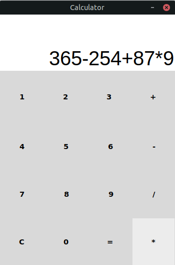

# calculator_v2.0
# Calculator v2.0 - More traditional calculator 

## Introduction
A traditional calculator made with Tkinter.
The project was made for learning practice purposes.

## Technologies
- Python 3.8.10
- Tkinter 8.6.10

## Setup
```
$ sudo apt install python3.8
$ python3.8
```
## Screenshot

